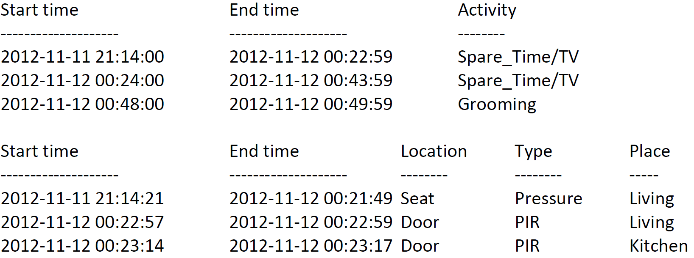
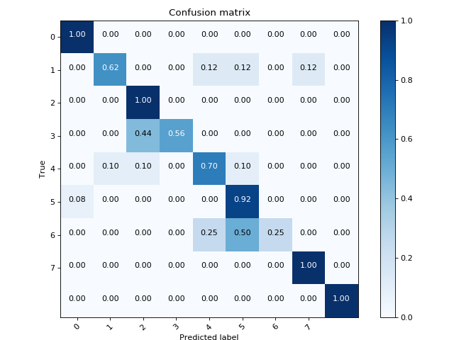
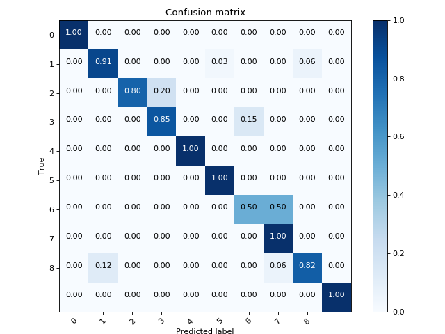

# SmartHouse
User activity prediction in smart homes

## Introduction
The goal of this project is to predict the activity of a user inside his home based on data collected by sensors. The data were collected by a monitoring system able to communicate with a central unit called "Mother"(picture below).

## Dataset exploration

The following activities has been monitored: *Leaving, Toileting, Showering, Sleeping, Breakfast, Dinner, Drink, Idle/Unlabeled, Lunch, Snack, Spare time/TV, Grooming*.

The sensor data streams have been divided into time intervals of constant length. For these experiments, the sensor data were segmented into intervals of 60 seconds length. For every timestamp the following data are available:

In order to create the HMM model, for each user, the datasets have been merged. To perform this integration, the common *"Start time"* and *"End time"* attributes were used, aftere being converted from ISO 8601 format (example: 2018-12-06 15:44:17) to the Unix Timestamp format (example: 1528811076 ) to facilitate the merge of the two datasets.

## Hidden Markov Model (HMM)

An HMM model has been implemented to exploits the data collected by the sensors as evidence to infer the activity performed by the user. In particular, the **Viterbi** algorithm has been used to find the most probable sequence of states based on a sequence of events observed.

The model's parameter have been calculated in the following way:

- `Start probability`: percentage of occurrences of each activity in the training set.
- `Transition probability`: percentage of occurrences of the steps from an S1 state to an S2 state in the training set.
- `Observations probability`: probability to observe a configuration of sensors for a certain activity.

### Training set and Test set

The test sets have been created based on the percentage of the total number of days. The test sets are therefore composed of complete days, that starts when the user begins to sleep and ends when the user returns to sleep. This choice is dictated by the fact that the events occurring in a day are dependent on each other. Two types of divisions were generated:

- Training 90% - Test 10% 
- Trining 65% - Test 35%

## Results

Splitting the datasets in 60 seconds time slices bring an improvement of the model's accuracy. Class 6 has a low accuracy because it's a short activity that happens rarely (snack).

  
     

Since the dataset was unbalanced beyond accuracy it is important to observe the F-measure.
Following are presented the quality measures for the two datasets:

<table>
<tr><th>Dataset A</th><th>Dataset B</th></tr>
<tr><td>

| |Precision| F-Measure | Recall|
|--|--|--|--|
|**Class 0**| 1 | 0.97 | 0.95 |
|**Class 1**| 0.81 | 0.85 | 0.91 |
|**Class 2**| 0.86 | 0.92 | 1 |
|**Class 3**| 0.96 | 0.81 | 0.71 |
|**Class 4**| 0.98 | 0.98 | 0.98 |
|**Class 5**| 1 | 1 | 1 |
|**Class 6**| 0.62 | 0.57 | 0.62 |
|**Class 7**| 1 | 1 | 1 |
|**Class 8**| 0.90 | 0.84 | 0.82 |
|**Class 9**| 1 | 1 | 1 |

</td><td>

| |Precision| F-Measure | Recall|
|--|--|--|--|
|**Class 0**| 0.37 | 0.48 | 0.74 |
|**Class 1**| 0.31 | 0.14 | 0.28 |
|**Class 2**| 0.97 | 0.91 | 0.85 |
|**Class 3**| 0.82 | 0.90 | 1 |
|**Class 4**| 0.17 | 0.21 | 0.37 |
|**Class 5**| 0.95 | 0.97 | 1 |
|**Class 6**| 1 | 0.97 | 0.94 |
|**Class 7**| 0.23 | 0.28 | 0.36 |
|**Class 8**| 1 | 0.90 | 0.82 |
|**Class 9**| 0.78 | 0.86 | 0.97 |
|**Class 10**| 1 | 1 | 1 |

</td></tr> </table>

